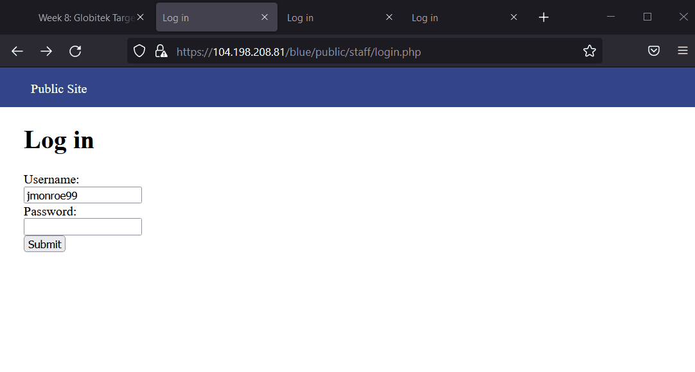
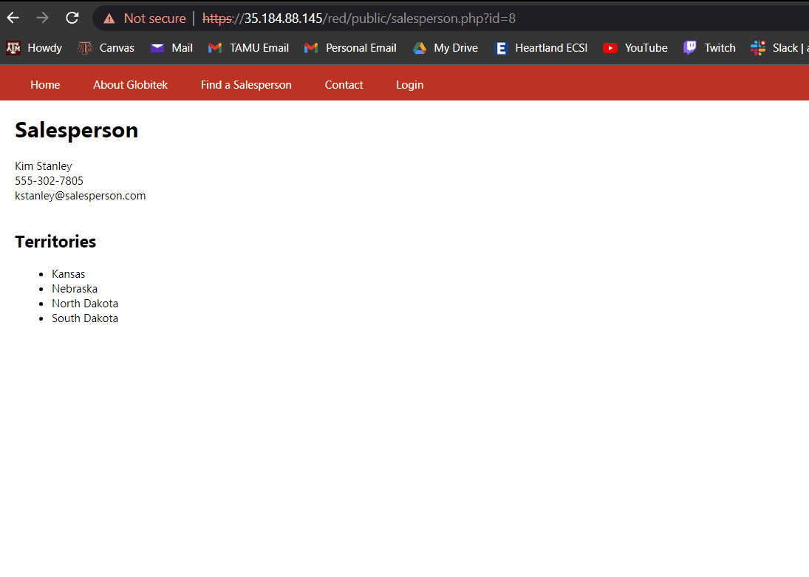

# Project 8 - Pentesting Live Targets

Time spent: 5 hours spent in total

> Objective: Identify vulnerabilities in three different versions of the Globitek website: blue, green, and red.

The six possible exploits are:

* Username Enumeration
* Insecure Direct Object Reference (IDOR)
* SQL Injection (SQLi)
* Cross-Site Scripting (XSS)
* Cross-Site Request Forgery (CSRF)
* Session Hijacking/Fixation

Each color is vulnerable to only 2 of the 6 possible exploits. First discover which color has the specific vulnerability, then write a short description of how to exploit it, and finally demonstrate it using screenshots compiled into a GIF.

## Blue

Vulnerability #1: __________________

Description:

## Green

Vulnerability #1: __________________

Description:

## Red

Vulnerability #1: Username Enumeration

Description: Using the existing usename "jmonroe99" I simply tried logging in with the username and a random password. The Blue and Green website gave me an Invalid Request because the username does not exist in the database. However, the Red website gave me an incorrect password response hinting the fact that the username exists. This vulnerability is caused due to the website giving the intruder too much log in information.

Vulnerability #2: Insecure Direct Object Reference

Description: The "Find a Salesperson" tab contains different people with unique ID numbers when clicked on them. Changing the id number will direct you to different salespeople. Normally if you were to enter a number that doesn't belong to anyone or someone that is not supposed to be there it would redirect you as seen in the GIF below. However, in the red website if you go one over the maximim ID you will run into a classified salesperson.

## Notes
N/A
